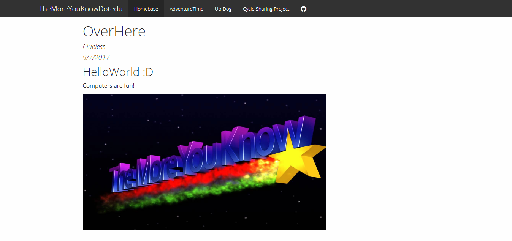

```{r setup, include=FALSE}
knitr::opts_chunk$set(echo = FALSE)

"what I learned in boating school is..."
```

## Dplyr

Dplyr is useful to concisely manipulate data and put it on a graph.

```{r, echo = TRUE, eval = FALSE}
trip_2 <- trip %>% mutate(tripduration_m = (trip_2$tripduration)/60)
```

vs.

```{r, echo = TRUE, eval = FALSE}
tripduration_m <- (trip_2$tripduration)/60
 trip22<-trip_2
 trip22<-cbind(trip22, tripduration_m)
```


## Building a Website




## Options with ggplot (plot() function)

```{r, echo = FALSE, eval = TRUE}
plot(pressure)
```

## Options with ggplot (ggplot() function)
```{r}
library(ggplot2)
ggplot(pressure, aes(x = temperature, y = pressure, col = pressure)) + 
  geom_point(size = 3, shape = 8) + 
  geom_line() + 
  theme_bw()
```


